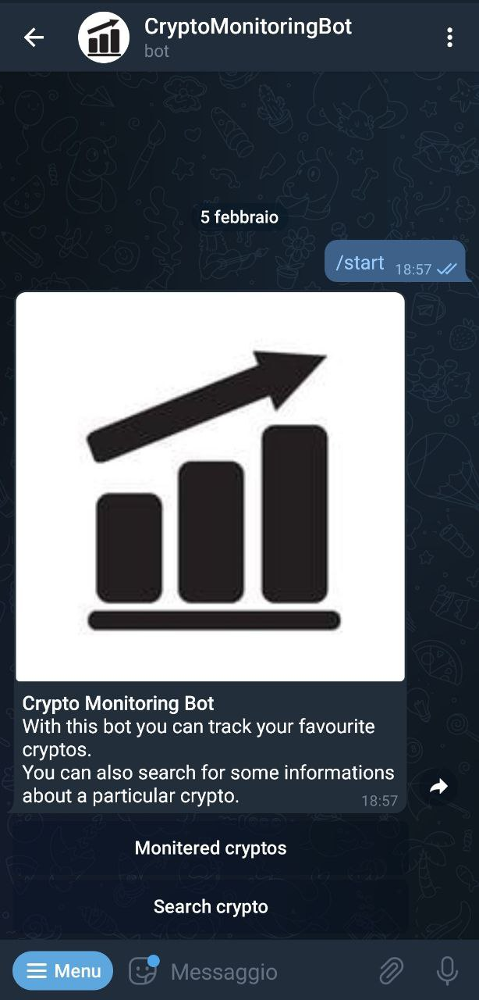

# crypto-monitoring-bot
Simple telegram bot that allows you to track your cryptos.

## Getting Started

### Telegram Bot Search
The nickname of the bot is: @CryptoAutoMonitoringBot

### Usage

The bot now implements three main commands: 
 
🚀 /start gives you a little introduction
 
📑 /monitoredcryptos lists all of your current tracked cryptos. You can add one by clicking on the "Add crypto" button.
 
🔎 /searchcrypto lets you search for a particular crypto's informations